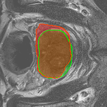
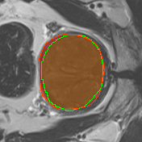
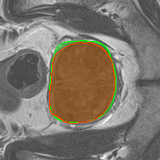
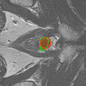
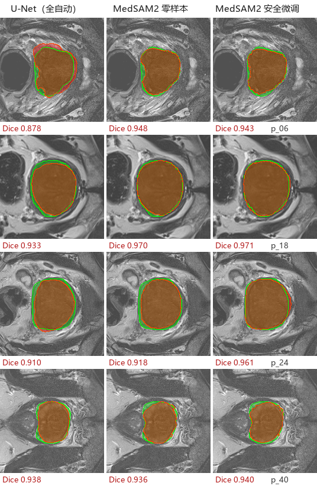
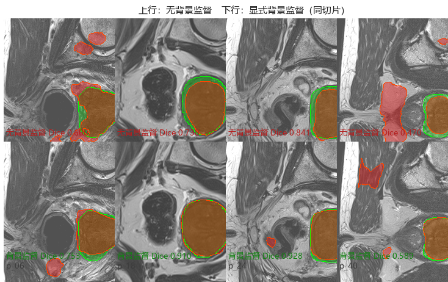
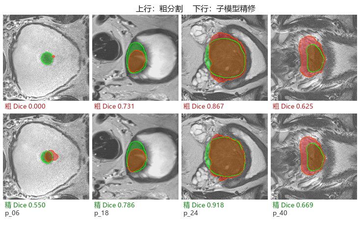

# 基于多序列 MRI 影像 AI 的前列腺增生手术必要性预测：分割与量化研究

> **模型权重**：[Releases v1.0](https://github.com/tianxingstarsky/Analysis-of-BPH/releases/tag/v1.0)
> （背景监督 U-Net 最优 0.9152 / MedSAM2 安全微调 / 精修子模型）

## 1. 研究目的

良性前列腺增生（BPH）的手术决策目前依赖 IPSS 评分、超声体积、PSA 等**间接指标**，
缺乏对前列腺内部结构（间质/腺体成分、尿道受压）的客观量化，存在"该做没做"与"不该做却做"
的双向误判。本研究是"基于多序列 MRI 影像 AI 的前列腺增生手术必要性精准预测"项目的
预研阶段，目标有三：

1. 打通**多序列 MRI → 前列腺自动分割 → ROI 质地/形态量化**的技术管线（Phase 1/2），
   在公开数据上验证可行性；
2. 确定**小数据条件下可靠的训练配置**，并通过消融实验明确各因素贡献；
3. 评估**基础模型（MedSAM2）交互式分割**在本任务上的上限，为项目标注环节选型。

技术路线（本研究完成 Phase 1a/1b/2，Phase 3 预测需手术结局标签到位后开展）：


## 2. 数据与方法

| 项目 | 配置 |
|---|---|
| 数据 | MSD Task05 Prostate：32 例 T2WI+ADC（层厚 3.6mm），标签=全腺体（外周带∪移行带）；切层后 475 张（413 训练 / 62 验证，**按病例划分**） |
| 预处理 | 病例级 z-score 标准化；训练时以腺体质心为中心裁剪 176px（±16px 抖动） |
| 模型 | U-Net（InstanceNorm）+ **显式背景监督双 Sigmoid 头**（最终方案）；MedSAM2（hiera-Tiny@512，零样本+安全微调） |
| 训练 | fp32，RMSprop 1e-4，batch 4，60 epoch，GPU 批处理增强 |
| 评估 | **逐病例 3D 体积 Dice**（主口径，MSD/文献标准）；逐切片 2D Dice 仅作参考 |
| 对照 | 旧基线（classes=2、全图输入、逐切片归一化）3D Dice 0.709 |

工程实现细节（AMP 发散、BatchNorm 小批量失效、Windows 多进程死锁等调试记录）
见 [docs/NOTES.md](docs/NOTES.md)。

## 3. 研究成果与分析

### 3.1 主结果：全自动分割 3D Dice 0.9152

| 模型 | 逐病例 3D Dice | 交互成本 |
|---|---|---|
| **U-Net + 显式背景监督（最终方案）** | **0.9152** | 全自动 |
| U-Net（前景单通道，消融基线） | 0.8725 | 全自动 |
| MedSAM2 零样本（每层框提示） | 0.9356 | 每层 1 框 |
| 旧基线（修复前） | 0.7090 | 全自动 |

最终模型预测可视化（绿=标注、红=预测、重合=黄色；p06 为原完全失效病例）：

<p float="left">
  
  
  
  
</p>

### 3.2 消融分析：增强方案 × 通道注意力


| 增强方案 | SE 注意力 | 3D Dice |
|---|---|---|
| **无增强** | **无** | **0.8725** |
| geo（仿射+翻转+强度扰动） | 有 | 0.8139 |
| bg（背景噪声+偏置场） | 有 | 0.8057 |
| full（全部组合） | 无 | 0.8049 |
| full（全部组合） | 有 | 0.7662 |
| warp（全图+背景弹性扭曲） | 有 | 0.3613 |
| 无增强 | 有 | 0.1481 |

**四点发现**：
1. **结构性修复贡献最大**（0.709→0.873）：`classes=1` 参数化、中心裁剪、病例级标准化
   三项合计超过任何数据增强的收益。小数据项目应优先把任务参数化和数据一致性做对。
2. **SE 通道注意力为负收益**：无增强时灾难性塌缩（0.87→0.15），全增强时也略差
   （0.805→0.766）。小数据 + 高动量优化器下 SE 门控易压死通道。
3. **增强不是免费的**：±14px 弹性扭曲有害（0.36）；经典轻量增强最稳，但相对无增强
   仍为负收益——本数据规模下"无增强"即最优。
4. **背景是最大的信息增益点**：见 3.4，显式背景监督带来 +0.043 的全场最大单项提升。

### 3.3 MedSAM2：基础模型零样本与安全微调

| 方案 | 3D Dice | 交互成本 |
|---|---|---|
| **MedSAM2 零样本** | **0.9356** | 每层 1 框（约 2 秒/层） |
| MedSAM2 安全微调后（精确框） | 0.9343 | 同上 |
| MedSAM2 安全微调后（抖动框 ±15%） | **0.9325** | 同上（微调前仅 0.9121） |
| MedSAM2 单框跨层传播（微调后） | 0.6477 | 仅 1 框 |

三个模型的同切片直接对比（4 例中层切片，每格下方为该切片 Dice；绿=标注、红=预测、
重合=黄色）：



各病例（中层切片）U-Net / 零样本 / 微调：p06 0.878/0.948/0.943，p18 0.933/0.970/0.971，
p24 0.910/0.918/0.961，p40 0.938/0.936/0.940——微调后在 4 例中 3 例优于零样本。

**分析**：
1. **基础模型零样本（0.936）即超越从头训练的专用模型（0.873）**——印证小数据医学 AI
   中"预训练权重 > 从零训练"的规律；
2. 零样本已接近能力上限（精确框下微调无提升），**安全微调的真实收益在松框鲁棒性
   +0.02**：框敏感度差从 24‰ 缩到 2‰，覆盖医生画框不精确的真实场景；
3. 安全配方（冻结 encoder/prompt encoder/全部 memory 模块，仅训 decoder 4.2M，
   lr 2e-5，框抖动）实现**零遗忘**：跨层传播不降反微升（+0.011）。

### 3.4 显式背景监督：让模型主动学习拒绝背景（+0.043，最大单项增益）

背景中的干扰结构（直肠暗环、盆腔亮骨、肌肉束）会与腺体抢响应，失败案例多源于此
（典型如 p06：粗分割仅输出点状预测）。解决方案：**双 Sigmoid 通道显式监督**——
通道 0 以前景标注监督（学分割腺体），通道 1 以**反转标注**监督（学分割并拒绝背景），
各自独立 BCE+Dice。相比 classes=2 softmax 竞争（两通道概率此消彼长，曾导致塌缩），
独立 Sigmoid 让背景获得明确的拒绝梯度，而不与前景抢概率预算。

| 模型 | 逐病例 3D Dice |
|---|---|
| U-Net + 显式背景监督 | **0.9152**（基线 0.8725，**+0.043**） |

同切片可视化对比——上行（无背景监督）预测明显外泄到直肠、肌肉等背景结构，
下行（显式背景监督）红色预测紧贴标注，背景干扰被有效拒绝：



分病例中层切片：p06 0.883（原完全失效病例）/ p18 0.950 / p24 **0.963**（超 MedSAM2
同切片 0.937）/ p40 0.782。

**分析**：与其调增强、堆注意力，不如改监督信号的结构——让背景承担显式的分割义务，
而不是默认"推向 0"。这是全场最大的单项增益，且零额外推理成本。

### 3.5 二次校准探索：两种方案均不采用

针对粗分割的系统误差，测试了两种二次校准（粗分割 = 0.8725）：

| 校准方式 | 3D Dice | 变化 |
|---|---|---|
| 传统形态学（最大连通域+闭运算+填洞） | 0.8726 | +0.0001（无增益） |
| 子模型精修（图像+粗mask 双通道轻量U-Net） | 0.8894 | +0.017 |



**采用决定：均不采用。** 形态学无增益的原因是预测已是干净单连通域，其误差为系统性
边界偏差，形态学只能修碎片类错误。子模型虽 +0.017，但人工审阅精修可视化发现
**掩码存在形态残缺**（轮廓毛刺、形状不完整）——Dice 的 +0.02 不构成临床采用理由，
形态完整性的优先级更高。该实验的价值：① 定位了残余误差类型（系统性边界偏差）；
② 再次印证"提分 ≠ 可用"。精修权重保留在 Release v1.0 供后续研究。

另测试了相对位置编码（SDF+质心坐标输入通道）用于精修子模型：0.8854，噪声级差异、
无增益——粗 mask 已隐式携带位置信息，位置通道冗余。**关于 YOLO 类检测-分割范式**：
经评估不采用——其掩码由低分辨率原型图线性组合生成，边界精度天然低于编码器-解码器
架构，而本任务恰是边界敏感的单实例 Dice 评估；可借鉴的形态是"检测器粗定位 → 分割器
精分割"两段式，用于解决部署时的自动定位问题。详见 [docs/NOTES.md](docs/NOTES.md)。

### 3.6 Phase 2 衍生：腺体质地/形态特征

以最优分割掩膜为 ROI，逐病例提取 5 项特征（`results/features_gt.csv`，32 例）：
全腺体体积（35-73 mL，均达增生标准）、外周带体积/占比、T2 信号均值（mean-SI-T2WI）、
ADC 均值——字段与杨建丽等（实用放射学杂志 2025）对齐，可直接衔接后续统计分析。
文献证实 mean-SI-T2WI 预测重度 IPSS 的 AUC 达 0.734，是手术必要性预测的核心特征。

## 4. 实验衍生数据

| 资源 | 位置 | 说明 |
|---|---|---|
| **模型权重（3 个）** | [Releases v1.0](https://github.com/tianxingstarsky/Analysis-of-BPH/releases/tag/v1.0) | 背景监督 U-Net（0.9152）/ MedSAM2 微调 / 精修子模型（未采用） |
| 质地/形态特征 | [results/features_gt.csv](results/features_gt.csv) | 32 例 × 5 字段 |
| 全部插图 | [figures/](figures/) | 消融柱状图、三模型对比、叠加图、增强示例 |
| 工程调试记录与负结果 | [docs/NOTES.md](docs/NOTES.md) | 关键 bug、评估口径、SE/warp/位置编码/YOLO-seg 评估 |

## 5. 项目思考题解答（8 问）

**Q1 临床问题与技术路线**：解决手术决策缺乏客观量化依据的问题。路线为
"分割 → 量化 → 预测"三段式；研究设计上 60 例回顾性训练、50 例前瞻性做时间隔离的外部验证。

**Q2 手术必要性金标准**：文献做法（杨建丽等 2025）以规范药物治疗下 IPSS 重度（≥20 分）
为分层标准，且已证明 MRI 质地可预测它（T2 信号均值 AUC 0.734）。建议：满足重度症状
或绝对指征（反复尿潴留/血尿/感染/肾功能损害）即有手术必要性；金标准采用随访手术转归
+ 术后病理间质比例验证。

**Q3 四种序列**：T1WI 解剖定位；T2WI 带状解剖显示最佳、可区分腺体与间质增生；DWI
反映弥散受限；ADC 是其定量 map。BPH 研究中 **T2WI 最重要**——质地成分评估、带状解剖
与尿道受压观察都依赖它（文献中效能最佳），ADC 作定量补充。

**Q4 DICOM 读三维体**：SimpleITK 按 ImagePositionPatient 物理坐标排序读取（不能按
文件名），保留 Spacing 等元数据；最易错的是层序错乱。

**Q5 高维小样本**：ICC 一致性过滤→相关聚类去冗→LASSO 筛选，特征数遵循
"每 10 个事件 ≤1 个特征"（5-8 个）；模型只用逻辑回归/线性 SVM；前瞻 50 例完全外推验证。

**Q6 NIfTI 输入 3D-CNN**：nibabel 读取→统一 spacing 重采样→ROI 裁剪固定尺寸→
病例级 z-score→[B,C,D,H,W] 张量；数据少可退化为 2.5D 三正交面方案。

**Q7 AUC 之外**：校准曲线（概率可信度）、决策曲线 DCA（临床净获益）、PPV/NPV、
亚组稳定性；漏诊与误切代价不对称，按临床后果选阈值。

**Q8 尿流动力学预测**：已有基石——动态 MRI+CFD 模拟排尿（Shahid 2024）与 MRI 参数
无创预测梗阻指数 BOOI。路线三步：先 MRI 特征预测 BOOI/Qmax 单点（复现已验证路线），
再做几何重建+CFD/DL 混合输出完整尿流曲线，最后 PINN 嵌入流体方程（尚无发表，创新点）。
最大困难：尿流由"梗阻+逼尿肌力"双因素决定，逼尿肌功能影像不可见，且需补采配对数据。

## 6. 复现指南

```bash
# 环境
conda create -n bph python=3.10 -y && conda activate bph
pip install torch torchvision --index-url https://download.pytorch.org/whl/cu124
pip install -r requirements.txt

# 数据下载与准备（MSD Task05，228MB）
python scripts/download_data.py
python scripts/prepare_task05.py t2

# 训练最终模型（显式背景监督）
cd segmentation
python train_bg.py            # 60 epoch，best 按逐病例 3D Dice 自动保存

# 评估（3D 口径，双 Sigmoid 前景通道）与可视化
python eval_3d.py --dual-sigmoid --crop 176 --classes 2 --se ../segmentation/checkpoints/bgsup_best.pth
python overlay_bgsup.py
```

MedSAM2 部署与评估见 [medsam2/README.md](medsam2/README.md)。

## 7. 目录结构

```
Analysis-of-BPH/
├── README.md                  # 本报告
├── requirements.txt
├── data/                      # prepare 脚本生成的切片数据（不入库）
├── docs/NOTES.md              # 工程调试记录与负结果
├── figures/                   # 报告全部插图
├── features/extract_features.py   # Phase 2 质地/形态特征
├── medsam2/                   # Phase 1b MedSAM2 零样本评估 + 安全微调
├── results/features_gt.csv    # 32 例 × 5 特征
├── scripts/                   # 数据下载 / 切层 / 报告图表生成
└── segmentation/              # Phase 1a U-Net 训练/评估（基于 milesial/Pytorch-UNet 修改）
```

## 8. 参考

- 数据：[MSD Task05 Prostate](https://decathlon.ai)（Radboud 大学，CC-BY-SA 4.0）
- 代码基础：[milesial/Pytorch-UNet](https://github.com/milesial/Pytorch-UNet)（MIT）；
  [bowang-lab/MedSAM2](https://github.com/bowang-lab/MedSAM2)
- 方法学：杨建丽等. 多参数 MRI 在良性前列腺增生质地评估中的应用价值. 实用放射学杂志, 2025, 41(10)
- Ronneberger O, et al. U-Net, MICCAI 2015 · Ma J, et al. MedSAM2, 2025 ·
  Isensee F, et al. nnU-Net, Nature Methods 2021
