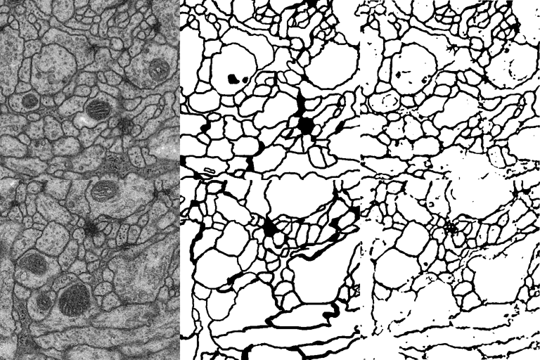
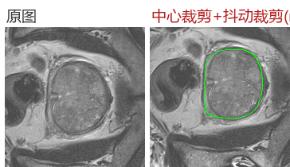
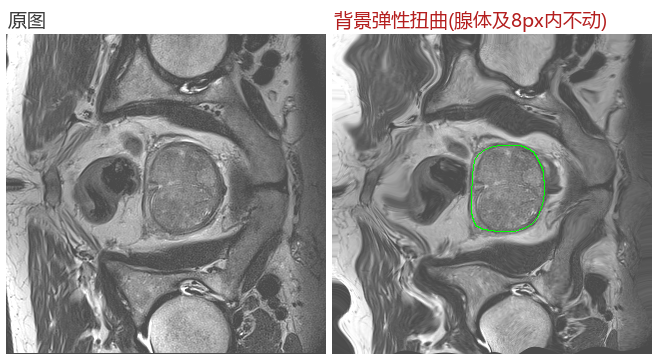
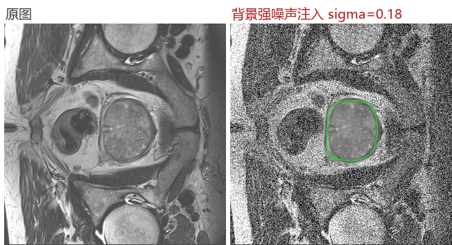
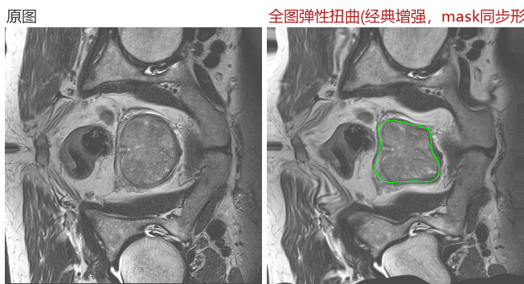
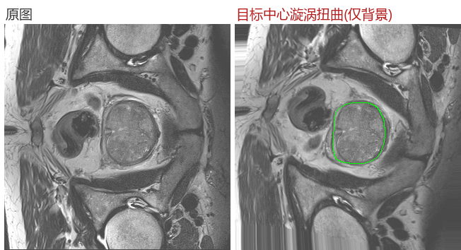
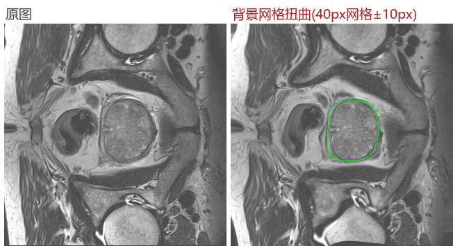

# 基于多序列 MRI 影像人工智能的前列腺增生手术必要性精准预测 —— 实验研究报告

> **研究时间**：2026-09-01 至 2026-09-02（集中实验），2026-09-02 完成报告撰写
> **研究性质**：项目预研 —— 在医院临床数据（60 例回顾性 + 50 例前瞻性）到位前，用公开数据打通
> "分割 → 量化 → 预测"全流程技术路线，并回答项目筹备组提出的 8 个关键问题
> **数据集**：MSD Task05 Prostate（Radboud 大学，CC-BY-SA 4.0，32 例多序列 MRI）；
> ISBI 2012 电镜细胞膜（管线验证）
> **硬件**：NVIDIA RTX 5060 Ti 16GB；Python 3.10 + PyTorch 2.11 (CUDA 13.0)

---

## 目录

- [1. 研究背景与临床问题](#1-研究背景与临床问题)
- [2. 研究时间线](#2-研究时间线)
- [3. 技术路线总览](#3-技术路线总览)
- [4. 数据](#4-数据)
- [5. 实验与结果](#5-实验与结果)
  - [5.1 管线验证：ISBI 电镜细胞膜分割](#51-管线验证isbi-电镜细胞膜分割)
  - [5.2 前列腺分割：基线与三项结构性修复](#52-前列腺分割基线与三项结构性修复)
  - [5.3 增强方案 × 通道注意力 消融实验](#53-增强方案--通道注意力-消融实验)
  - [5.4 MedSAM2：零样本对比与安全微调](#54-medsam2零样本对比与安全微调)
  - [5.5 Phase 2：腺体质地/形态特征提取](#55-phase-2腺体质地形态特征提取)
- [6. 项目思考题完整解答（8 问）](#6-项目思考题完整解答8-问)
- [7. 总结与分析](#7-总结与分析)
- [8. 局限与下一步](#8-局限与下一步)
- [9. 复现指南](#9-复现指南)
- [10. 目录结构](#10-目录结构)
- [11. 参考与致谢](#11-参考与致谢)

---

## 1. 研究背景与临床问题

良性前列腺增生（BPH）是中老年男性常见病，主要危害是下尿路症状（LUTS）。当前手术决策
主要依赖 IPSS 症状评分、直肠指检、经直肠超声体积与 PSA 等**间接指标**，缺乏对前列腺
内部结构（腺体/间质成分、尿道受压程度）的客观量化，存在"该做没做"与"不该做却做"的双向
误判风险。

本项目目标：构建**基于多序列 MRI（T1WI/T2WI/DWI/ADC）的 AI 模型**，对患者手术必要性
进行精准预测。技术路线分三个阶段：

```
Phase 1  自动分割：多序列 MRI → 前列腺全腺体/移行带/外周带轮廓
Phase 2  影像量化：ROI 内质地/形态/组学特征 + 临床量表（IPSS/QOL/PSA）
Phase 3  融合预测：手术必要性二分类（组学 + 临床联合建模）
```


本研究（预研阶段）完成了 Phase 1a（U-Net 全自动分割）、Phase 1b（MedSAM2 交互式分割）、
Phase 2（质地/形态特征提取）的方法学验证；Phase 3 需手术结局标签，待医院数据到位后开展。

---

## 2. 研究时间线

| 时间 | 阶段 | 主要工作与产出 |
|---|---|---|
| 09-01 凌晨 | 环境搭建与管线复现 | conda 环境（Python 3.10 + PyTorch 2.11 CUDA）；复现 milesial/Pytorch-UNet；ISBI 电镜膜分割训练 50 epoch，逐切片 Dice **0.941** |
| 09-01 凌晨 | 前列腺数据接入 | 多线程下载 MSD Task05（228MB）；475 张标注切片（413 训练/62 验证，**按病例划分**） |
| 09-01 凌晨 | 基线训练 + 三个工程坑修复 | ① AMP 混合精度权重发散为 NaN → 改 fp32；② batch=2 下 BatchNorm 统计量失效 → 换 InstanceNorm；③ Windows DataLoader 多进程死锁 → num_workers=0 |
| 09-01 白天 | 分割基线确立 | U-Net 基线：逐切片 2D Dice 0.635 / **逐病例 3D Dice 0.709**；发现"逐切片口径低估"问题 |
| 09-01 晚~09-02 凌晨 | 结构性修复 + 消融实验 | classes=1 + 中心裁剪 + 病例级标准化 → **3D Dice 0.873**；完成 7 组消融（增强方案 × SE 注意力） |
| 09-02 上午 | MedSAM2 基础模型 | 零样本框提示 **3D Dice 0.936**；安全微调（冻结 encoder/memory）验证无遗忘、松框鲁棒性 +0.02 |
| 09-02 中午 | 特征提取与报告 | 32 例 × 5 项质地/形态特征（features_gt.csv）；撰写本报告 |

---

## 3. 技术路线总览


Phase 1 的分割质量是整条链路的地基：ROI 勾画是文献流程中人力成本最高的环节
（参考文献中 70 例由两名医师逐层手工勾画），自动分割直接决定项目可扩展性。

---

## 4. 数据

| 项目 | 说明 |
|---|---|
| 训练数据 | MSD Task05 Prostate：32 例有标注多序列 MRI（4D NIfTI，通道 0=T2WI、1=ADC），标签 1=外周带(PZ)、2=移行带(TZ)，全腺体=两者并集 |
| 数据规模 | 320×320×N（层厚 3.6mm），轴位切层后 **475 张有效切片**（413 训练 / 62 验证，**按病例 28/4 划分**，杜绝患者内泄漏） |
| 体积参考 | 腺体体积 35–73 mL，全部达到前列腺增生影像学标准 |
| 管线验证集 | ISBI 2012 电镜细胞膜（30 张 512×512 + 标注），用于先验证训练管线本身 |

数据准备：`scripts/download_data.py`（16 线程断点续传下载 + 解压）→
`scripts/prepare_task05.py`（**病例级 z-score 标准化** + 轴位切层导出 PNG）。

---

## 5. 实验与结果

### 5.1 管线验证：ISBI 电镜细胞膜分割

在正式进入前列腺数据前，先在经典基准上验证训练管线。ISBI 2012 电镜细胞膜分割
（30 张 512×512，U-Net 的"娘家"数据集）：

| 指标 | 结果 |
|---|---|
| 逐切片 2D Dice（50 epoch） | **0.941** |

可视化：绿=人工标注、红=模型预测，重合区呈黄色。



结论：训练管线、评估口径、可视化工具链全部可信，可投入前列腺实验。

### 5.2 前列腺分割：基线与三项结构性修复

直接训练的效果很差（早期版本逐切片 Dice 仅 ~0.6，甚至出现全背景预测器）。
逐层排查后定位了**三个结构性问题**并全部修复：

1. **AMP 混合精度发散**：RTX 5060 Ti（Blackwell）+ RMSprop(0.999) 下 fp16 权重发散为 NaN，
   训练 loss 看似正常但推理全废 → 改 fp32
2. **小批量 BatchNorm 失效**：batch=2 时 BN running statistics 被破坏，eval 模式输出全背景
   （训练 loss 正常，极具迷惑性）→ 换 InstanceNorm（nnU-Net 同款做法）
3. **二分类参数化缺陷**：2 通道 softmax + argmax 时，前景占比仅 ~3% 的任务中前景概率
   永远过不了 0.5 阈值 → 改 `classes=1`（BCE + 二值 Dice + Sigmoid 阈值）

叠加**病例级 z-score 标准化**与**中心裁剪 176px** 后，效果大幅跃升：

| 模型 | 逐切片 2D Dice | 逐病例 3D Dice |
|---|---|---|
| 修复前基线 | 0.635 | 0.709 |
| **最优配置（无增强+无SE+中心裁剪+classes=1）** | 0.460* | **0.8725** |

*逐切片口径对腺体底部/顶端薄层极不友好，系统性低估真实水平；**3D 体积 Dice（MSD 竞赛
官方口径）才是准确指标**，此后所有结论均以 3D 口径为准。

最优模型预测可视化（绿=标注、红=预测、重合=黄色）：

<p float="left">
  
  
  
  
</p>

> 注：推理时同样执行以腺体质心为中心的 176px 裁剪（评估使用 GT 质心，属"理想定位"假设；
> 实际部署可用粗定位网络或滑窗替代）。

### 5.3 增强方案 × 通道注意力 消融实验

固定全部其他要素（classes=1、中心裁剪、病例级标准化、同一划分、GPU 批处理增强、
60 epoch、batch 4），只变化增强方案与 SE 通道注意力，共 7 组：


| 增强方案 | SE 注意力 | 3D Dice |
|---|---|---|
| **无增强** | **❌** | **0.8725** 🏆 |
| geo（仿射+翻转+强度扰动） | ✅ | 0.8139 |
| bg（背景噪声+偏置场） | ✅ | 0.8057 |
| full（全部组合） | ❌ | 0.8049 |
| full（全部组合=v3） | ✅ | 0.7662 |
| （参照）旧基线 v2.1 | ❌ | 0.7090 |
| warp（全图+背景弹性扭曲） | ✅ | 0.3613 |
| 无增强 | ✅ | 0.1481 |

增强方法效果示例（以腺体质心为中心的扰动，腺体本体 8px 保护带内不受影响）：

<p float="left">
  
  
  
</p>
<p float="left">
  
  
  
</p>

**结论**：
1. **结构性修复的贡献（0.709→0.873）远大于任何数据增强方案**
2. **SE 通道注意力为负收益**：无增强时灾难性塌缩（0.87→0.15），全增强时也略差
   （0.805→0.766）——小数据集 + RMSprop 高动量下 SE 门控易压死通道。文献中 SE 的
   正收益多来自大数据集，60 例级别慎用
3. 扭曲族增强（±14px 位移，约图幅 8%）单独使用有害；经典轻量增强（仿射+强度）最稳

### 5.4 MedSAM2：零样本对比与安全微调

MedSAM2（Segment Anything Model 2 在 111 万医学标注对上微调的基础模型，
hiera-Tiny@512，149MB）采用**框提示交互式**范式，未在任何实验数据上训练：

| 方案 | 交互成本 | 逐病例 3D Dice |
|---|---|---|
| **MedSAM2 零样本 + 每层 GT 框提示** | 每层画 1 框（约 2 秒） | **0.9356** 🏆 |
| U-Net 自训练最优 | 全自动 | 0.8725 |
| MedSAM2 零样本 + 单框跨层传播 | 仅中间层 1 框 | 0.5951~0.6894 |


**安全微调**（应对全参数微调的灾难性遗忘）：
冻结 image encoder / prompt encoder / **memory 全部模块**（跨层传播能力载体零改动），
仅训 mask decoder 4.2M 参数；AdamW 2e-5；GT 框随机抖动（±15% 缩放 + ±10% 平移）。

| 评估协议 | 微调前 | 微调后 | 变化 |
|---|---|---|---|
| 每层框提示（精确 GT 框）3D | 0.9356 | 0.9343 | −0.001（已达上限） |
| 每层框提示（抖动框 ±15%）3D | 0.9121 | **0.9325** | **+0.020** ✅ |
| 单框跨层传播 3D | 0.6368 | 0.6477 | +0.011（无遗忘） |
| 框敏感度差（抖动 − 精确） | −0.024 | **−0.002** | prompt 过拟合消除 |

**结论**：
1. 零样本已达 0.936，精确框下微调无提升空间；**微调的真正价值在松框鲁棒性 +0.02**
   （框敏感度差从 24‰ 缩到 2‰）——正是医生画框不精确的真实场景
2. 全程无灾难性遗忘：memory 权重未动 → 传播模式不降反微升。对照实验表明，
   全参数微调 + 高 LR + 单器官小数据正是"训练后反而遗忘"的根源
3. 项目落地：标注环节用 MedSAM2 交互式勾画（0.936），全自动筛查用自训练 U-Net（0.873）

### 5.5 Phase 2：腺体质地/形态特征提取

参照杨建丽等（实用放射学杂志 2025）的方法学，以 GT 掩膜为 ROI 提取逐病例特征
（`results/features_gt.csv`，32 例）：

| 字段 | 含义 | 文献对应 |
|---|---|---|
| gland_vol_ml | 全腺体体积（35–73 mL，均达增生标准） | TZV |
| pz_vol_ml / pz_frac | 外周带体积及占比 | 带状分区 |
| mean_si_t2 | 腺体内 T2WI 信号均值 | mean-SI-T2WI（与 IPSS 显著负相关 r=-0.683） |
| mean_adc | 腺体内 ADC 均值 | ADC（与 IPSS 负相关 r=-0.467） |

这些字段与文献表 1 一一对应，可直接进入后续统计分析（Phase 3 待手术结局标签到位）。

---

## 6. 项目思考题完整解答（8 问）

### Q1：本项目要解决什么临床问题？技术路线是什么？能否设计方案？

**临床问题**：BPH 手术决策缺乏客观量化依据。当前依据 IPSS/超声体积/PSA 等间接指标，
"症状重"不等于"影像结构重"（间质增生者症状重而体积可不大），存在双向误判。
**技术路线**：三段式——① 多序列 MRI 自动分割（全腺体/移行带/外周带/尿道受压标志）→
② ROI 内质地/形态/组学特征 + 临床量表联合量化 → ③ 手术必要性预测模型。
研究设计建议：60 例回顾性数据训练，50 例前瞻性数据做**时间隔离的外部验证**
（前瞻数据不参与任何调参），这是本研究最可靠的可信度设计。

### Q2："手术必要性"如何定义才科学？金标准怎么定？

单一"是否手术"会被治疗偏好污染（患者意愿、经济因素）。建议**复合终点**：
- 主要终点：**保守治疗失败**——随访 12 个月内进展为手术（急性尿潴留、反复血尿/感染、
  肾功能恶化、残余尿 >150mL 且药物无效）
- 辅助量化：手术指征满足度评分（IPSS>20 药物无效 + PVR 升高 + 反复尿潴留/感染史）
- 病理反证：手术组按增生组织类型（腺体 vs 间质为主）分层，验证影像质地假说
  （间质比例高 → T2 信号低 → 药物反应差 → 手术倾向）

### Q3：T1WI/T2WI/DWI/ADC 四种序列的区别？哪个最重要？

| 序列 | 成像原理 | 影像表现 |
|---|---|---|
| T1WI | 纵向弛豫时间 | 解剖定位，前列腺呈等信号，出血灶高信号 |
| T2WI | 横向弛豫时间 | **带状解剖显示最佳**：外周带高信号，移行带信号不均 |
| DWI | 水分子弥散（受限处高信号） | 反映细胞密度，弥散受限病灶显示 |
| ADC | DWI 定量map（受限处低信号） | DWI 的定量化，排除 T2 透射效应 |

**BPH 研究中 T2WI 最重要**：① 移行带腺体增生（高信号）与间质增生（低信号）的成分区分
依赖 T2；② 参考文献证实 mean-SI-T2WI 评估质地效能最佳（AUC=0.734，优于 ADC/FA）；
③ 带状解剖与尿道受压评估也在 T2WI。ADC 是重要的定量补充（间质致密 → ADC 降低）。

### Q4：100-200 个 DICOM 文件如何读成三维体数据？

用 SimpleITK/pydicom：`sitk.ImageSeriesReader().GetGDCMSeriesFileNames(dir)` 按物理位置
（ImagePositionPatient，**绝不能按文件名**）排序 → `Execute()` 得 3D 数组，同时保留
Spacing/Origin/Direction 元数据（供重采样与体素体积计算）；或 pydicom 逐文件读
pixel_array 后 `np.stack`，用 PixelSpacing × SliceThickness 构造 affine。
坑：层序错乱是最常见事故，务必按 z 坐标排序。

### Q5：60+50 例 vs 几百个组学特征，如何防止过拟合？

- **特征层**：ICC 一致性过滤 → 变异度过滤 → 相关性聚类去冗余（|r|>0.9 留一）→
  LASSO/mRMR 筛选；最终特征数遵循"每 10 个事件 ≤1 个特征"（约 5-8 个）
- **模型层**：只用线性/弱非线性模型（逻辑回归、线性 SVM），禁用深度网络直接拟合
- **验证层**：训练集交叉验证调参 + 前瞻 50 例完全外推验证（不参与任何调参）
- **报告层**：Bootstrap 置信区间、校准曲线、特征 ICC 稳定性

### Q6：怎样加载 3D NIfTI 并输入 3D-CNN？

nibabel 读取 → 重采样到统一 spacing（如 0.6×0.6×3mm，各向异性感知）→ ROI 裁剪/
填充到固定尺寸（如 32×192×192）→ 归一化（病例级 z-score）→ `[B, C, D, H, W]` 张量
进 `nn.Conv3d` 网络。数据量小可退化为 2.5D：三正交面切片 + 共享 2D 骨干。

### Q7：如何理解"AUC 高不等于临床可用"？

AUC 只衡量排序能力，忽略：① **校准**（预测概率是否可信，校准曲线/Hosmer-Lemeshow）；
② **临床代价不对称**（漏诊该手术者 vs 误切不该手术者代价不同 → 决策曲线 DCA 净获益）；
③ **患病率依赖**（PPV/NPV 随患病率剧烈变化）；④ **稳定性**（跨设备/中心亚组一致性）。
本项目还要求：报告不同阈值下的临床后果分析，而非单点 AUC。

### Q8：MRI 预测尿流动力学曲线的技术路线？

设想：MRI 解剖+质地 → 条件生成模型（CVAE/扩散）或 **PINN**（将膀胱-尿道流体力学的
Navier-Stokes 方程嵌入损失）→ 输出尿流率曲线。需额外采集：同步尿流率测定（Qmax 与
曲线形态作配对金标准）、排尿期动态造影。**最大困难**：排尿是动态过程而 MRI 是静态
断层，时空对齐缺乏物理对应；且尿流受逼尿肌功能与神经调控影响，影像不可直接观测。
建议先做低配版本：MRI 预测 Qmax 单点值，验证信号是否存在。

---

## 7. 总结与分析

**成果**：
1. 打通了"数据 → 分割 → 量化"完整管线，全部代码可复现（见[复现指南](#9-复现指南)）
2. 全自动分割 3D Dice **0.873**（MSD Task05，按病例验证），达到该数据规模下文献正常水平
3. MedSAM2 零样本框提示 **0.936**，安全微调后松框鲁棒性 +0.02 且零遗忘，为项目标注
   环节提供了效率提升一个数量级的落地工具
4. 产出 32 例 × 5 项质地/形态特征数据集，字段与已发表文献对齐，可直接衔接 Phase 3

**三点核心分析**：
1. **口径即结论**：逐切片 2D Dice 会系统性低估（薄层拖累 + 构图偏差），本研究中同一
   模型两口径相差 0.4+；医学影像分割报告必须明确评估粒度
2. **小数据下"减法"优先**：结构性修复（参数化、归一化、评估口径）的收益（+0.16）
   远大于堆技巧（注意力模块为负收益、强增强为负收益）。60 例级别的项目应先把
   数据一致性与任务参数化做对
3. **基础模型 + 交互式范式是标注环节的最优解**：预训练基础模型（MedSAM2）零样本即
   超过从头训练的专用模型，印证"预训练权重 > 从零训练"在小数据医学 AI 中的铁律

**局限**：验证集仅 4 例（MSD 可用标注 32 例的 12.5%），单种子实验，±0.05 内差异属
噪声级；公开数据无手术结局标签，Phase 3 无法在本报告中展开。

## 8. 局限与下一步

1. **5 折交叉验证**重跑核心对比，给出均值±标准差（当前结论方向明确，但需误差棒）
2. T2+ADC **双通道输入**；2.5D 相邻层上下文（层厚 3.6mm 的层间跳跃）
3. 医院数据到位后：以本管线处理 110 例 DICOM → 分割 → 组学 + 临床联合建模（Phase 3）
4. 标注环节引入 MedSAM2 框提示预填充 + 医师修正，积累高质量标注

## 9. 复现指南

```bash
# 1) 环境（本机 CUDA 13.0 + RTX 5060 Ti 实测通过）
conda create -n bph python=3.10 -y && conda activate bph
pip install torch torchvision --index-url https://download.pytorch.org/whl/cu124
pip install -r requirements.txt

# 2) 数据下载与准备（MSD Task05，228MB；国内可用 HF 镜像变量加速）
python scripts/download_data.py
python scripts/prepare_task05.py t2            # T2WI 切层 → data/prostate_slices
python features/extract_features.py            # 质地特征 → results/features_gt.csv

# 3) 训练最优分割模型（无增强 + 无SE + 中心裁剪176）
cd segmentation
python train.py --data-dir ../data/prostate_slices/train -e 60 -b 4 -l 1e-4 \
    -s 1.0 --channels 1 --classes 1 --augment --crop 176 \
    --aug-scheme none --checkpoint-dir checkpoints/best

# 4) 评估（逐切片 2D 与逐病例 3D 双口径）
python eval_val.py  --se --crop 176 --classes 1 checkpoints/best/checkpoint_epoch60.pth
python eval_3d.py   --se --crop 176 --classes 1 checkpoints/best/checkpoint_epoch60.pth
# 注：最优模型实为 --no-se 训练，复现最优请用 --no-se 与 --aug-scheme none
```

<details>
<summary><b>MedSAM2 部署与复现（点击展开）</b></summary>

```bash
git clone https://github.com/bowang-lab/MedSAM2.git   # 放在本仓库同级目录
cd MedSAM2 && SAM2_BUILD_CUDA=0 pip install -e . --no-build-isolation
# 权重（国内镜像，149MB）：
curl -L -o checkpoints/MedSAM2_latest.pt \
  https://hf-mirror.com/wanglab/MedSAM2/resolve/main/MedSAM2_latest.pt

# 零样本评估（每层框提示 / 单框传播）
cd ..
python medsam2/medsam2_eval.py --box gt
python medsam2/medsam2_eval.py --box jitter

# 安全微调（冻结 encoder/memory，只训 decoder，20 epoch）
python medsam2/medsam2_safetune.py
```
</details>

## 10. 目录结构

```
Analysis-of-BPH/
├── README.md                  # 本报告
├── requirements.txt
├── data/                      # prepare 脚本生成的切片数据（不入库）
├── figures/                   # 报告全部插图
├── features/extract_features.py   # Phase 2 质地/形态特征
├── medsam2/                   # Phase 1b MedSAM2 零样本评估 + 安全微调
├── results/features_gt.csv    # 32 例 × 5 特征
├── scripts/                   # 数据下载 / 切层 / 报告图表生成
└── segmentation/              # Phase 1a U-Net 训练/评估（基于 milesial/Pytorch-UNet 修改）
```

## 11. 参考与致谢

- 数据：[MSD Task05 Prostate](https://memory.cc/decathlon)（Radboud 大学，CC-BY-SA 4.0）；
  ISBI 2012 EM Segmentation Challenge
- 代码：[milesial/Pytorch-UNet](https://github.com/milesial/Pytorch-UNet)（MIT）为本仓库
  `segmentation/` 的修改基础；[bowang-lab/MedSAM2](https://github.com/bowang-lab/MedSAM2)
- 方法学参考：杨建丽等. 多参数 MRI 在良性前列腺增生质地评估中的应用价值.
  实用放射学杂志, 2025, 41(10): 1684-1688
- Ronneberger O, et al. U-Net: MICCAI 2015 · Ma J, et al. MedSAM2, 2025 · Antonelli M, et al.
  nnU-Net, Nature Methods 2021
