# 基于多序列 MRI 影像 AI 的前列腺增生手术必要性预测：分割与量化研究

> **模型权重**：[Releases v1.0](https://github.com/tianxingstarsky/Analysis-of-BPH/releases/tag/v1.0)
> （U-Net 最优模型 + MedSAM2 安全微调权重）

## 1. 研究目的

良性前列腺增生（BPH）的手术决策目前依赖 IPSS 评分、超声体积、PSA 等**间接指标**，
缺乏对前列腺内部结构（间质/腺体成分、尿道受压）的客观量化，存在"该做没做"与"不该做却做"
的双向误判。本研究是"基于多序列 MRI 影像 AI 的前列腺增生手术必要性精准预测"项目的
预研阶段，目标有三：

1. 打通**多序列 MRI → 前列腺自动分割 → ROI 质地/形态量化**的技术管线（Phase 1/2），
   在公开数据上验证可行性；
2. 确定**小数据条件下可靠的训练配置**，并通过消融实验明确各因素贡献；
3. 评估**基础模型（MedSAM2）交互式分割**在本任务上的上限，为项目标注环节选型。

技术路线（本研究完成 Phase 1a/1b/2，Phase 3 预测需手术结局标签到位后开展）：

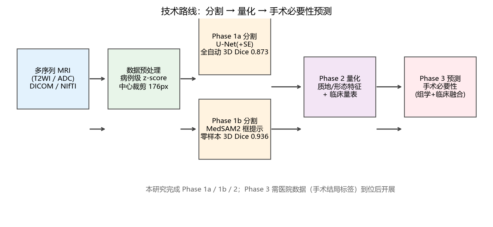

## 2. 数据与方法

| 项目 | 配置 |
|---|---|
| 数据 | MSD Task05 Prostate：32 例 T2WI+ADC（层厚 3.6mm），标签=全腺体（外周带∪移行带）；切层后 475 张（413 训练 / 62 验证，**按病例划分**） |
| 预处理 | 病例级 z-score 标准化；训练时以腺体质心为中心裁剪 176px（±16px 抖动） |
| 模型 | U-Net（InstanceNorm，`classes=1`：BCE+二值 Dice）；MedSAM2（hiera-Tiny@512，零样本+安全微调） |
| 训练 | fp32，RMSprop 1e-4，batch 4，60-80 epoch，GPU 批处理增强 |
| 评估 | **逐病例 3D 体积 Dice**（主口径，MSD/文献标准）；逐切片 2D Dice 仅作参考 |
| 对照 | 旧基线（classes=2、全图输入、逐切片归一化）3D Dice 0.709 |

工程实现细节（AMP 发散、BatchNorm 小批量失效、Windows 多进程死锁等调试记录）
见 [docs/NOTES.md](docs/NOTES.md)。

## 3. 研究成果与分析

### 3.1 主结果：全自动分割 3D Dice 0.873

| 模型 | 逐病例 3D Dice | 交互成本 |
|---|---|---|
| U-Net 最优（本项目） | **0.8725** | 全自动 |
| 旧基线（修复前） | 0.7090 | 全自动 |
| MedSAM2 零样本（每层框提示） | 0.9356 | 每层 1 框 |

最优模型预测可视化（绿=标注，红=预测，重合=黄色；逐病例 3D Dice 见文件名）：

<p float="left">
  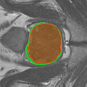
  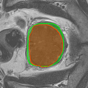
  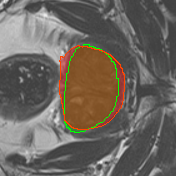
  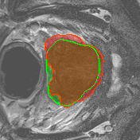
</p>

### 3.2 消融分析：增强方案 × 通道注意力

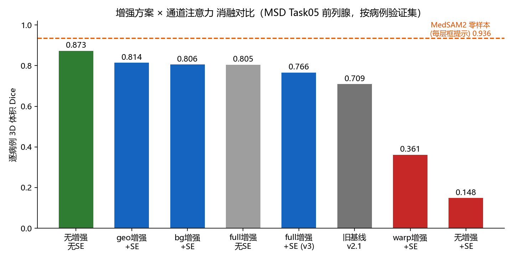

| 增强方案 | SE 注意力 | 3D Dice |
|---|---|---|
| **无增强** | **无** | **0.8725** |
| geo（仿射+翻转+强度扰动） | 有 | 0.8139 |
| bg（背景噪声+偏置场） | 有 | 0.8057 |
| full（全部组合） | 无 | 0.8049 |
| full（全部组合） | 有 | 0.7662 |
| warp（全图+背景弹性扭曲） | 有 | 0.3613 |
| 无增强 | 有 | 0.1481 |

**分析**：
1. **结构性修复贡献最大**（0.709→0.873）：`classes=1` 参数化、中心裁剪、病例级标准化
   三项加起来超过任何数据增强的收益。小数据项目应优先把任务参数化和数据一致性做对。
2. **SE 通道注意力为负收益**：无增强时灾难性塌缩（0.87→0.15），全增强时也略差
   （0.805→0.766）。小数据 + 高动量优化器下 SE 门控易压死通道；文献中 SE 的正收益
   多建立在大数据集上。
3. **增强不是免费的**：±14px 弹性扭曲对边界敏感的腺体分割有害（0.36）；经典轻量增强
   （仿射+强度）最稳，但相对无增强仍为负收益——本数据规模下，"无增强"即最优。

### 3.3 MedSAM2：零样本超越自训练，安全微调消除 prompt 过拟合

| 方案 | 3D Dice | 交互成本 |
|---|---|---|
| **MedSAM2 零样本** | **0.9356** | 每层 1 框（约 2 秒/层） |
| MedSAM2 安全微调后（精确框） | 0.9343 | 同上 |
| MedSAM2 安全微调后（抖动框 ±15%） | **0.9325** | 同上（微调前仅 0.9121） |
| MedSAM2 单框跨层传播（微调后） | 0.6477 | 仅 1 框 |

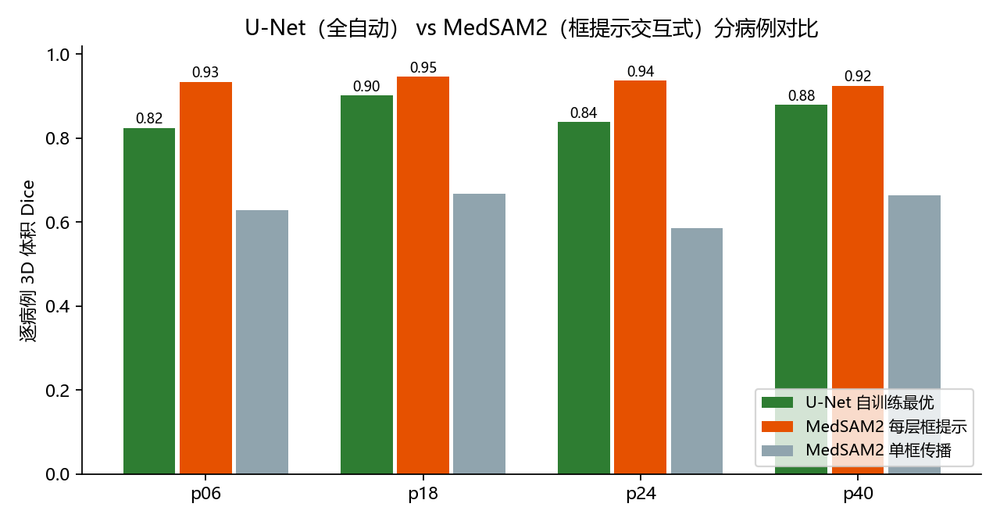

MedSAM2 零样本预测可视化（每层框提示协议，绿=标注、红=预测、重合=黄色）：

<p float="left">
  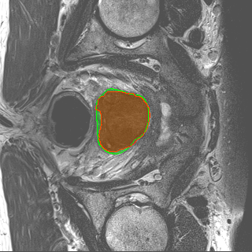
  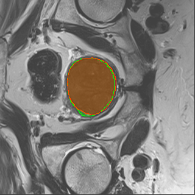
  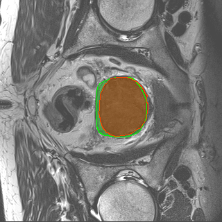
  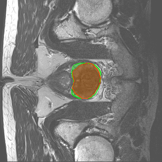
</p>

**分析**：
1. **基础模型零样本（0.936）即超越从头训练的专用模型（0.873）**——印证小数据医学 AI
   中"预训练权重 > 从零训练"的规律；
2. 零样本已接近能力上限（精确框下微调无提升），**安全微调的真实收益在松框鲁棒性
   +0.02**：框敏感度差从 24‰ 缩到 2‰，正好覆盖医生画框不精确的真实场景；
3. 安全配方（冻结 encoder/prompt encoder/全部 memory 模块，仅训 decoder 4.2M，
   lr 2e-5，框抖动）实现**零遗忘**：跨层传播不降反微升（+0.011）。对照全参数微调
   + 高 LR 的单器官小数据训练，这正是"训练后反而遗忘"的根源。

### 3.4 Phase 2 衍生：腺体质地/形态特征

以最优分割掩膜为 ROI，逐病例提取 5 项特征（`results/features_gt.csv`，32 例）：
全腺体体积（35-73 mL，均达增生标准）、外周带体积/占比、T2 信号均值（mean-SI-T2WI）、
ADC 均值——字段与杨建丽等（实用放射学杂志 2025）对齐，可直接衔接后续统计分析。
文献证实 mean-SI-T2WI 预测重度 IPSS 的 AUC 达 0.734，是手术必要性预测的核心特征。

## 4. 实验衍生数据

| 资源 | 位置 | 说明 |
|---|---|---|
| **模型权重** | [Releases v1.0](https://github.com/tianxingstarsky/Analysis-of-BPH/releases/tag/v1.0) | U-Net 最优（124MB）+ MedSAM2 微调（149MB），含加载方式 |
| 质地/形态特征 | [results/features_gt.csv](results/features_gt.csv) | 32 例 × 5 字段（腺体体积/PZ体积/PZ占比/T2信号均值/ADC均值） |
| 全部插图 | [figures/](figures/) | 消融柱状图、对比图、叠加图、增强示例 |
| 工程调试记录 | [docs/NOTES.md](docs/NOTES.md) | 三个关键 bug 的现象/定位/修复，及管线验证记录 |

## 5. 项目思考题解答（8 问）

**Q1 临床问题与技术路线**：解决手术决策缺乏客观量化依据的问题。路线为
"分割 → 量化 → 预测"三段式；研究设计上 60 例回顾性训练、50 例前瞻性做时间隔离的外部验证。

**Q2 手术必要性金标准**：文献做法（杨建丽等 2025）以规范药物治疗下 IPSS 重度（≥20 分）
为分层标准，且已证明 MRI 质地可预测它（T2 信号均值 AUC 0.734）。建议：满足重度症状
或绝对指征（反复尿潴留/血尿/感染/肾功能损害）即有手术必要性；金标准采用随访手术转归
+ 术后病理间质比例验证。

**Q3 四种序列**：T1WI 解剖定位；T2WI 带状解剖显示最佳、可区分腺体与间质增生；DWI
反映弥散受限；ADC 是其定量 map。BPH 研究中 **T2WI 最重要**——质地成分评估、带状解剖
与尿道受压观察都依赖它（文献中效能最佳），ADC 作定量补充。

**Q4 DICOM 读三维体**：SimpleITK 按 ImagePositionPatient 物理坐标排序读取（不能按
文件名），保留 Spacing 等元数据；最易错的是层序错乱。

**Q5 高维小样本**：ICC 一致性过滤→相关聚类去冗→LASSO 筛选，特征数遵循
"每 10 个事件 ≤1 个特征"（5-8 个）；模型只用逻辑回归/线性 SVM；前瞻 50 例完全外推验证。

**Q6 NIfTI 输入 3D-CNN**：nibabel 读取→统一 spacing 重采样→ROI 裁剪固定尺寸→
病例级 z-score→[B,C,D,H,W] 张量；数据少可退化为 2.5D 三正交面方案。

**Q7 AUC 之外**：校准曲线（概率可信度）、决策曲线 DCA（临床净获益）、PPV/NPV、
亚组稳定性；漏诊与误切代价不对称，按临床后果选阈值。

**Q8 尿流动力学预测**：已有基石——动态 MRI+CFD 模拟排尿（Shahid 2024）与 MRI 参数
无创预测梗阻指数 BOOI。路线三步：先 MRI 特征预测 BOOI/Qmax 单点（复现已验证路线），
再做几何重建+CFD/DL 混合输出完整尿流曲线，最后 PINN 嵌入流体方程（尚无发表，创新点）。
最大困难：尿流由"梗阻+逼尿肌力"双因素决定，逼尿肌功能影像不可见，且需补采配对数据。

## 6. 复现指南

```bash
# 环境
conda create -n bph python=3.10 -y && conda activate bph
pip install torch torchvision --index-url https://download.pytorch.org/whl/cu124
pip install -r requirements.txt

# 数据下载与准备（MSD Task05，228MB）
python scripts/download_data.py
python scripts/prepare_task05.py t2

# 训练最优分割模型
cd segmentation
python train.py --data-dir ../data/prostate_slices/train -e 60 -b 4 -l 1e-4 -s 1.0 \
    --channels 1 --classes 1 --augment --crop 176 \
    --aug-scheme none --no-se --checkpoint-dir checkpoints/best

# 评估（3D 口径）
python eval_3d.py --no-se --crop 176 --classes 1 checkpoints/best/checkpoint_epoch60.pth
```

MedSAM2 部署与评估见 [medsam2/README.md](medsam2/README.md)。

## 7. 参考

- 数据：[MSD Task05 Prostate](https://decathlon.ai)（Radboud 大学，CC-BY-SA 4.0）
- 代码基础：[milesial/Pytorch-UNet](https://github.com/milesial/Pytorch-UNet)（MIT）；
  [bowang-lab/MedSAM2](https://github.com/bowang-lab/MedSAM2)
- 方法学：杨建丽等. 多参数 MRI 在良性前列腺增生质地评估中的应用价值. 实用放射学杂志, 2025, 41(10)
- Ronneberger O, et al. U-Net, MICCAI 2015 · Ma J, et al. MedSAM2, 2025 ·
  Isensee F, et al. nnU-Net, Nature Methods 2021
